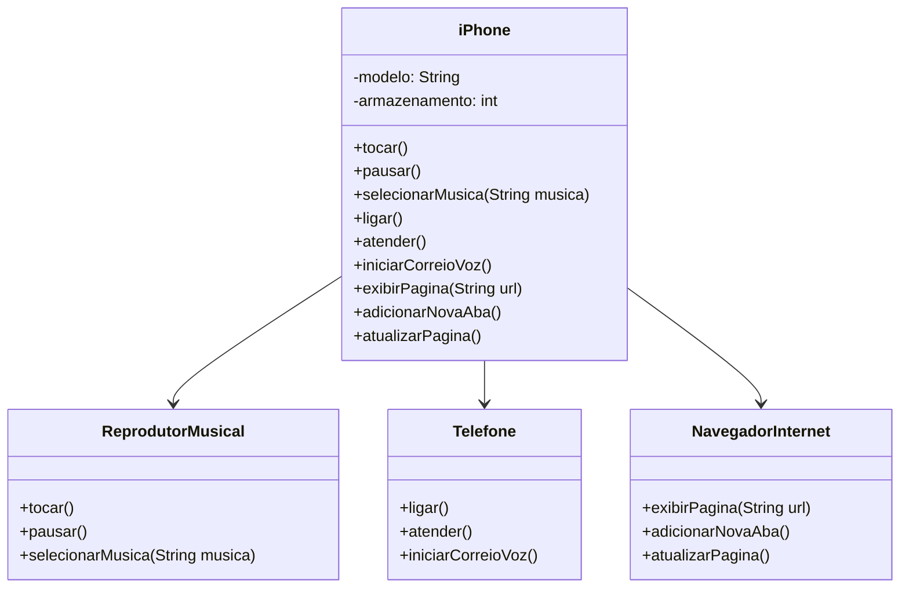

# 📱 Desafio de Modelagem - iPhone Orientado a Interfaces

Este projeto é parte do **Bootcamp Santander 2025 - Backend Java Developer**, oferecido em parceria com a **DIO**.  
O desafio propõe simular o comportamento de um **iPhone** por meio de uma modelagem baseada em **interfaces Java**.

---

## 🚀 Objetivo

Modelar as funcionalidades básicas de um iPhone, respeitando os princípios da **orientação a objetos** e da **programação modular**. O iPhone deve ser capaz de:

- Reproduzir músicas
- Realizar chamadas telefônicas
- Navegar na internet

---

## 🔧 Estrutura do Projeto

O sistema foi dividido em **interfaces** responsáveis por modularizar cada grupo de funcionalidades:

- `ReprodutorMusical`: define os comportamentos de um player de música.
- `Telefone`: encapsula as ações de um dispositivo telefônico.
- `NavegadorInternet`: descreve funcionalidades típicas de um navegador web.

A classe `iPhone` **implementa todas essas interfaces**, consolidando os comportamentos em um único dispositivo.

---

## 📐 Diagrama UML (Mermaid)

## 🧠 Conceitos Abordados

- **Programação Orientada a Objetos (POO)**
- **Interfaces Java**
- **Encapsulamento e separação de responsabilidades**
- **Modelagem com UML simplificada (Mermaid)**

